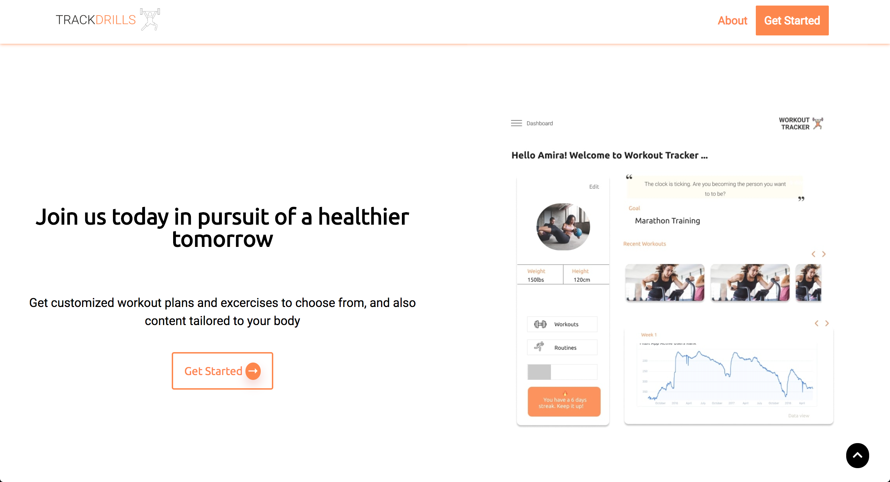

# About Trackdrills

Trackdrills is an application that gives you access to over 500 workouts and exercises to choose from to suit your fitness goals. It is a health-focused app that also gives you the ability to create your own customized workout plans and track your progress.

# Meet the Team

|                                          [Ezekiel Ekunola](https://github.com/easybuoy)                                          |                                                [Amira Adediran](https://github.com/amxra)                                                 |                                         [Modurotolu Olokode](https://github.com/durotolu)                                          |                                       [Folasade Agbaje](https://github.com/estheragbaje)                                       |                                   [Melquisedeque Pereira](https://github.com/melquip)                                    |
| :------------------------------------------------------------------------------------------------------------------------------: | :---------------------------------------------------------------------------------------------------------------------------------------: | :--------------------------------------------------------------------------------------------------------------------------------: | :----------------------------------------------------------------------------------------------------------------------------: | :----------------------------------------------------------------------------------------------------------------------: |
|         |                     |           |  |  |
|                                             |                                                         |                                               |                                       |                                      |
|          |  |  |  |  |
|                                    [**Sandrava Philips**](https://github.com/Sandravaphilips)                                    |                                           [**Oluwafemi Anjorin**](https://github.com/Leelsmuth)                                           |                                                                                                                                    |
|  |                 |                                                                                                                                    |
|                                      |                                                     |                                                                                                                                    |
|   |          |

# Project Overview

[Trello Board](https://trello.com/b/iTrFFYwu/labseu3-workout-tracker)  
[Product Canvas](https://www.notion.so/EU3-Workout-Tracker-07d713eeab674a938ea65ce065462384)  
[UX Design files](https://www.figma.com/file/r3J1gqHSg2Mci8tHb6vXdd/Trackdrills)  
[Landing Page](https://trackdrills.com/)  
[Application Page](https://app.trackdrills.com/)  
[API](https://trackdrills.herokuapp.com/)  

# Table of Contents

- [Scripts](#scripts)
  - [Running](#running)
- [Tech-Stack](#tech-stack)
  - [Dependencies](#dependencies)
    - [Html](#html)
    - [Less](#Less)
    - [AOS](#Aos)
    - [Google Fonts](#Google-fonts)
    - [Font Awesome](#Font-awesome)
    - [Google Analytics](#Google-analytics)

# Scripts

## Running

`npm run compile`: Runs and compiles the less files to css files in production.

`less-watch-compiler`: Runs and compiles the less files to css files in development.

# Tech-Stack

## Dependencies

### Html

Html

### Less

GraphQL is a query language for APIs and a runtime for fulfilling those queries with your existing data. GraphQL provides a complete and understandable description of the data in your API, gives clients the power to ask for exactly what they need and nothing more, makes it easier to evolve APIs over time, and enables powerful developer tools. | [View Dependency](https://graphql.org/)

### AOS

GraphQL is a query language for APIs and a runtime for fulfilling those queries with your existing data. GraphQL provides a complete and understandable description of the data in your API, gives clients the power to ask for exactly what they need and nothing more, makes it easier to evolve APIs over time, and enables powerful developer tools. | [View Dependency](https://graphql.org/)

### Google Font

GraphQL is a query language for APIs and a runtime for fulfilling those queries with your existing data. GraphQL provides a complete and understandable description of the data in your API, gives clients the power to ask for exactly what they need and nothing more, makes it easier to evolve APIs over time, and enables powerful developer tools. | [View Dependency](https://graphql.org/)

### Font Awesome

GraphQL is a query language for APIs and a runtime for fulfilling those queries with your existing data. GraphQL provides a complete and understandable description of the data in your API, gives clients the power to ask for exactly what they need and nothing more, makes it easier to evolve APIs over time, and enables powerful developer tools. | [View Dependency](https://graphql.org/)

### Google Analytics

GraphQL is a query language for APIs and a runtime for fulfilling those queries with your existing data. GraphQL provides a complete and understandable description of the data in your API, gives clients the power to ask for exactly what they need and nothing more, makes it easier to evolve APIs over time, and enables powerful developer tools. | [View Dependency](https://graphql.org/)
